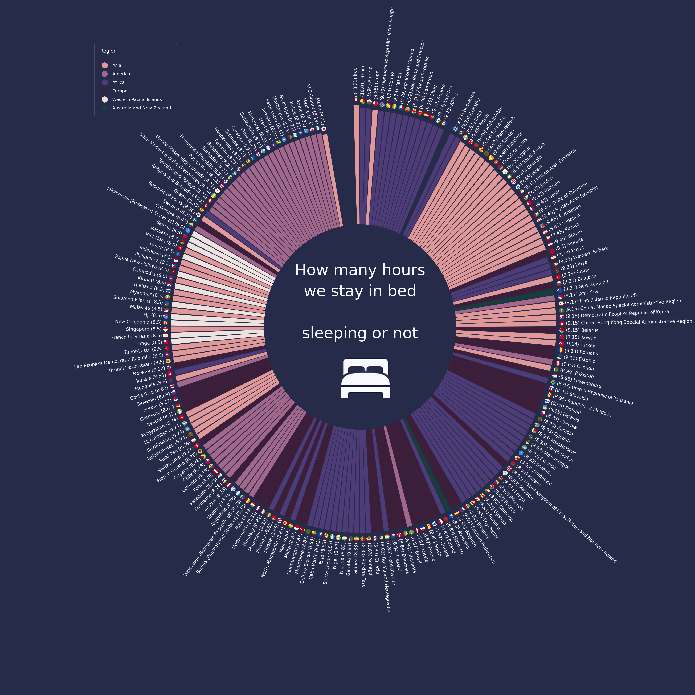

## Week 37, Year 2023

This week, data come from [The Human Chronome Project](https://www.humanchronome.org/) and more precisely from their paper [The global human day in PNAS](https://www.pnas.org/doi/10.1073/pnas.2219564120#sec-2).

As the last time I made a polar plot, I have used Python instead of R.

I have to give special credits to [Oscar Leo](https://medium.com/@oscarleo) for his article [How to Create a Polar Histogram With Python and Matplotlib](https://towardsdatascience.com/how-to-create-a-polar-histogram-with-python-and-matplotlib-9e266c22c0fa) which I read and I wanted to give it a try. 

So, this was the perfect moment to plot something similar, choosing to see how many hours people from different countries spend in their bed, [sleeping or not](https://www.pnas.org/doi/10.1073/pnas.2219564120#sec-2), in average.

For the flags I have used the [circle-flags](https://github.com/HatScripts/circle-flags) repository from [HatScripts](https://github.com/HatScripts). As they are SVG files, I had to transform them to PNG using the [cairosvg](https://cairosvg.org/) package. 

The data were already pretty 'clean' so I just had to combine the 'all_countries' dataframe with the 'country_regions' dataframe in order to take the country name, the iso2 code and the region. 
Due to the fact that the countries were divided into 20 regions, for making the graph more clear and easier to read, I used regex to replace each region with the continent (except Oceania which is divided to 'Australia & New Zealand' and 'Western Pacific Islands').

In general, people from Central-Africa and Middle-East spend more time in/on bed and those from America and Western Pacific Islands spend the least. 

From Europe, the most time in bed is spent by the Cypriots (9.45 hours per day) and the less by the Swedish (8.37 hours per day).

Japanese are by far the ones that less time spend in the comfort of their bed and Iraqis and Benzines spend more than 10 hours per day  laying or sleeping.

