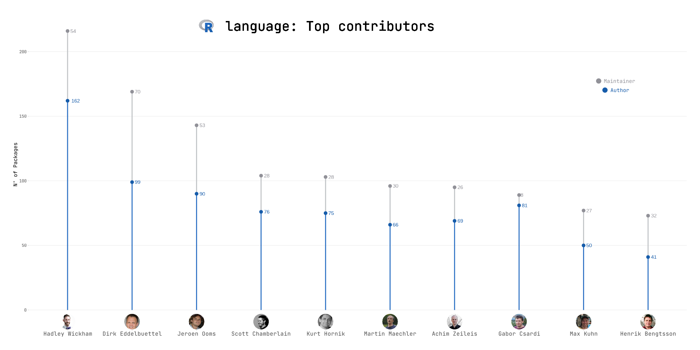

This week, TidyTuesday data examines the [CRAN packages' authors and maintainers](https://github.com/schochastics/CRAN_collaboration)!

I decided to make a 'light' plot to pay attribute to the ones that more have contributed to the R project, by writing and maintaining all these packages that we use in our analysis. 

Although the plot only shows the top 10 contributors by the total number of packages, this week's project is a big thank you to everyone who contributes not only in R project but in whichever open source project. 

I had to use some Regular Expressions to extract the names of the maintainers because they were in the form of: <Name(s)> <Surname(s)> <email> and sometimes the name was, for example A. or if there were more than one Surname, it could be in the form \<surname\> - \<surname\> or they could have a space between them. 

```
maintainers <- stringr::str_extract(cran$Maintainer, '["\']?(.*)["\']?\\s<.*', group = TRUE)
```

In order to plot the images of each contributor, I have used the [magick](https://cran.r-project.org/web/packages/magick/index.html) package to reshape and make them round. Of course, the process has been done in a 'for' loop to automate it. 
```
# Create a circle
jpeg(tf <- tempfile(fileext = ".jpeg"), 1000, 1000)
par(mar = rep(0,4), yaxs="i", xaxs="i")
plot(0, type = "n", ylim = c(0,1), xlim=c(0,1), axes=F, xlab=NA, ylab=NA)
plotrix::draw.circle(.5,0.5,.5, col="black")
dev.off()

# Make the path
path = paste0('./Images/', auth_maint$Name, '.jpeg')

# Modify each foto (with the magick package) to be in a circle and save it
for (photo in path){
  img <- magick::image_read(photo)
  mask <- magick::image_read(tf)
  mask <- magick::image_scale(mask, as.character(magick::image_info(img)$width))
  image <- magick::image_composite(mask, img, "plus")

  magick::image_write(image, path = str_replace(photo, ".jpeg", "_circle.jpeg"), format = "jpeg")
}
```

Once the photos were ready, they were saved as a JPEG file and inserted, with another 'for' loop, to the final plot.

```
# The first x positions for the first photo
x1 <- 0.5
x2 <- x1 + 1

# Insert each contributor's photo to the plot
for (contributor in p$data$Name) {
  # Take the path for each contributor
  path = paste0("./Images/", contributor, "_circle.jpeg")
  # Read the image and transform it in order to be able to be plotted
  img <- jpeg::readJPEG(path, native = TRUE)
  img <- grid::rasterGrob(img, interpolate = TRUE)

  # Add the photo to the plot
  p <- p +
    annotation_custom(img, xmin = x1, xmax = x2, ymin = -15, ymax = -3)

  # Adjust the x positions for the next photo
  x1 <- x1 + 1
  x2 <- x1 + 1

}
```

All the colors are based on the colors of the R logo.


