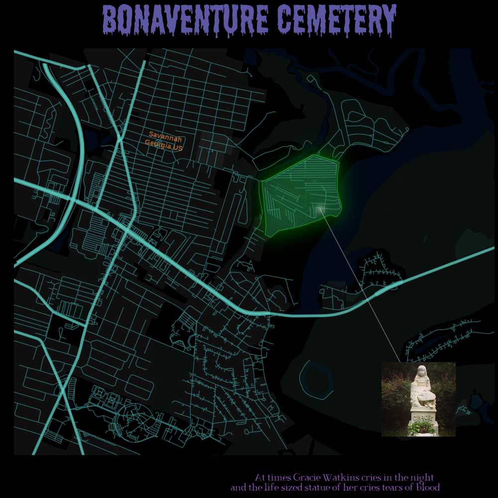

This week the data are about [Haunted Places in the United States](https://github.com/timothyrenner/shadowlands-haunted-places) but except celebrating Halloween, this dataset is to remind that [several R packages for spatial data have reached their end of life](https://geocompx.org/post/2023/rgdal-retirement/index.html).

I saw the contribution of [Nicola Rennie](https://github.com/nrennie/tidytuesday/tree/main/2023/2023-10-10) which inspired me to search and study the {[osmdata](https://docs.ropensci.org/osmdata/index.html)} package.

I spend some time reading all the documents and information because I found the package to be apart from very interesting, extremely well documented and I was not completely aware of its functionalities.

So, I will write a blog post about how I used it to create the below plot which I will post to my page. 

As for the TidyTuesday challenge, I have to recognise that I did something completely out of the box, not using the dataset provided (just a part of the description of a specific observation-the description of the Bonaventure Cemetery). The reason is that I wanted to experiment with the {osmdata} package as much as possible.

So, I searched for the [most haunted cemeteries in the USA](https://www.onlyinyourstate.com/usa/haunted-cemeteries-usa/) and I decided to plot the second in the list, the Bonaventure Cemetery in Savannah, Georgia which is also related somehow with the book Midnight in the Garden of Good and Evil.

A blog post with the explaining of the code will be uploaded in the near future. 

