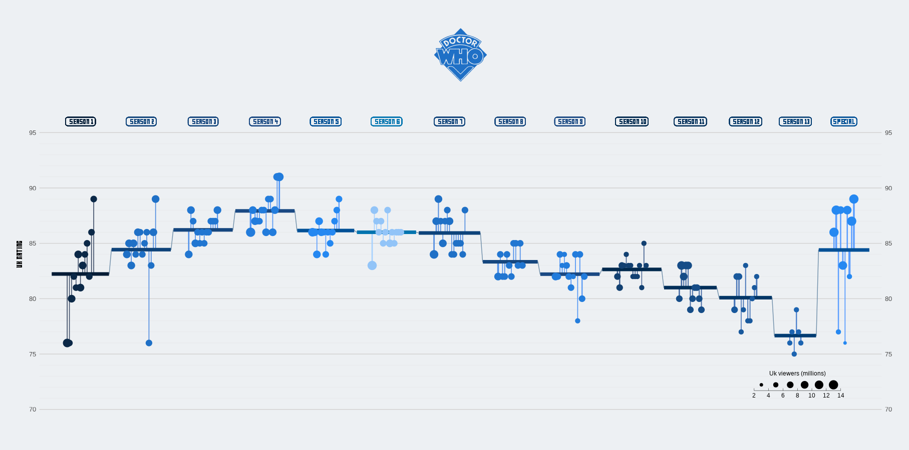
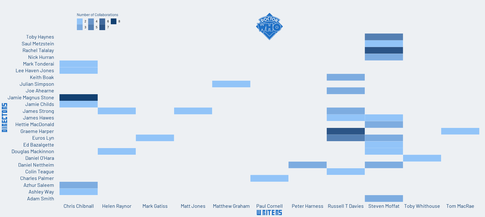

This week the data are about [Dr. Who TV Series](https://github.com/rfordatascience/tidytuesday/blob/master/data/2023/2023-11-28/readme.md) of BBC. 

It's been 7 weeks since I last participated in the TidyTuesday because I have some other projects going on and I am learning some advanced SQL techniques.This is the reason that I wanted to do something simple for this week and also to dive into some ggplot2 tricks I did not know before. 

The first graph is a simple modification of [Cedric Scherer](https://www.cedricscherer.com/)'s visualisation of the 12th Week of 2020 of TidyTuesday which you can find [here](https://github.com/z3tt/TidyTuesday/blob/main/R/2020_12_TheOffice.Rmd). I remember seeing it some months ago and I loved it, so this was a chance to replicate it and study it better. **All credits for this visualisation go to Cedric Scherer**.

One modification i have made and is not easily visible is that the width of lines for each episode represent its duration. In order to achieve it, I had to normalize the data 
`drwho_episodes_avg$duration_norm <- scales::rescale(drwho_episodes_avg$duration)`. 

I also made a simple heatmap showing the collaborations between Writers and Directors of the series that have worked together at least twice. 

